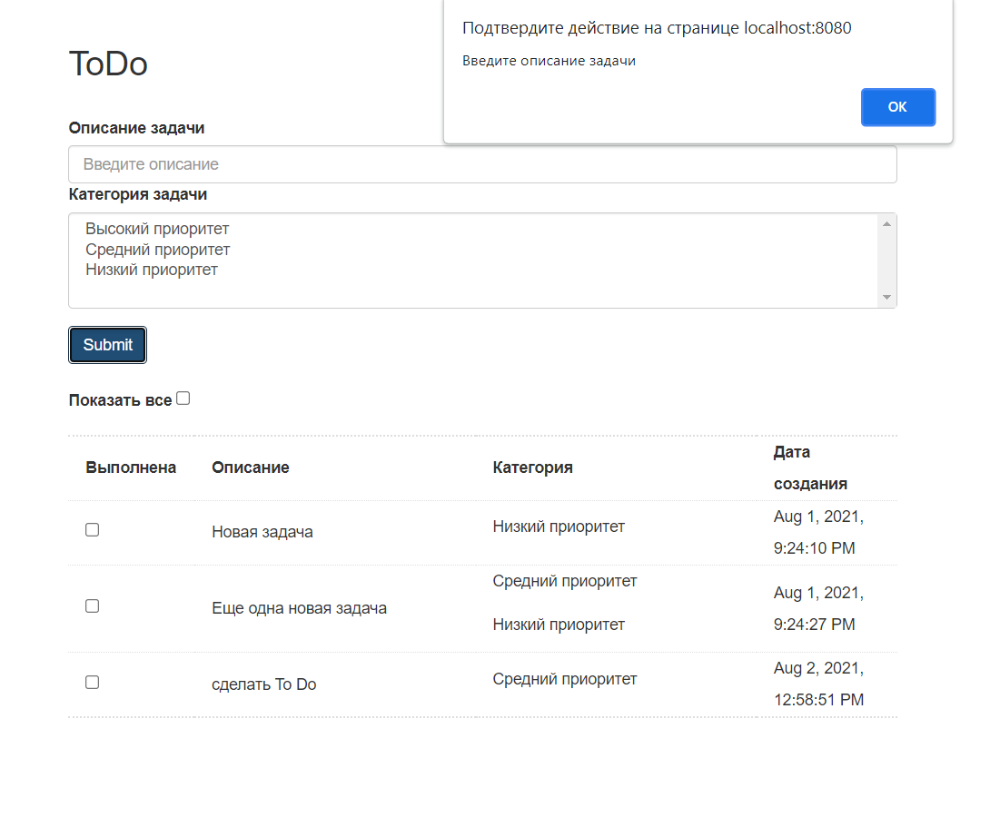
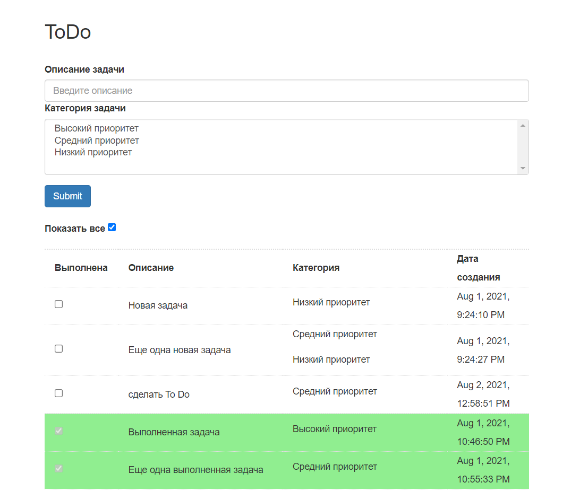
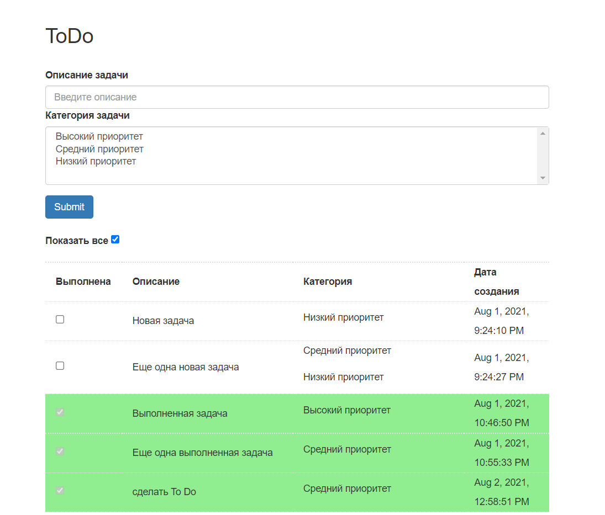

TODO список

Приложение имеет одну страницу со списком дел index.html.
Если дело сделано, то его отмечают, как выполненное и оно исчезает из списка.
Можно посмотреть список всех дел, включая выполненные.

